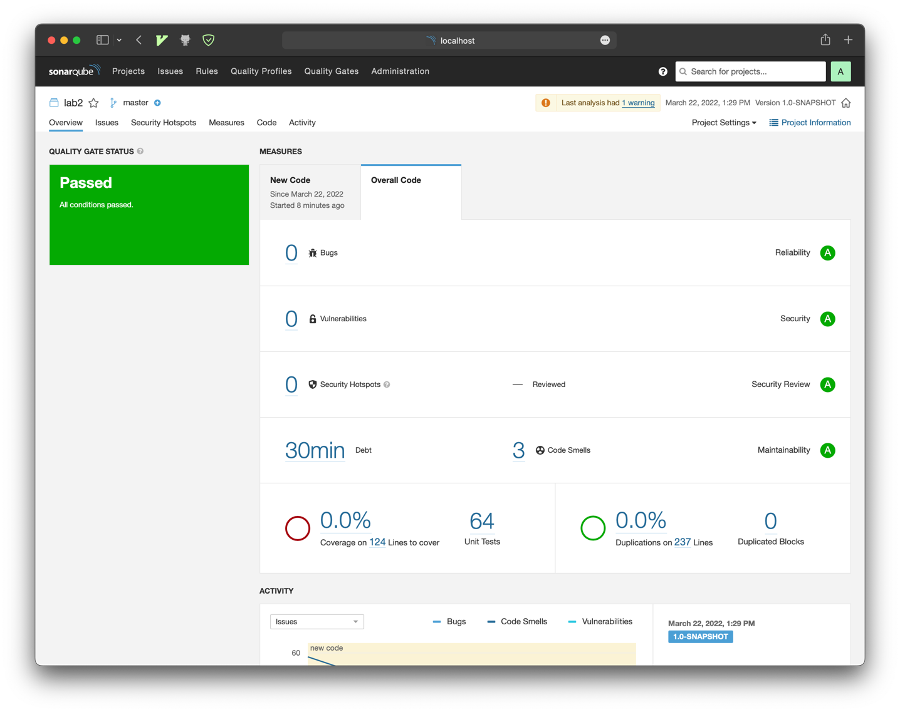
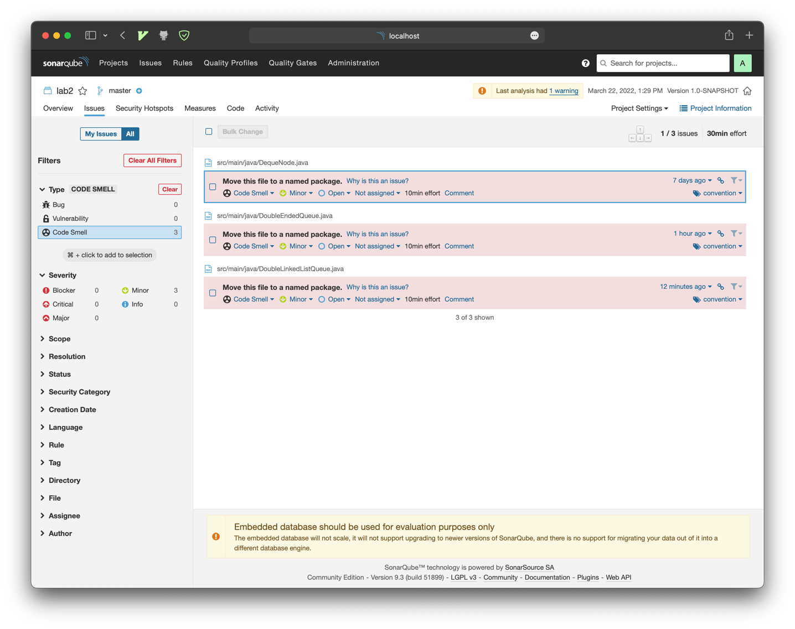
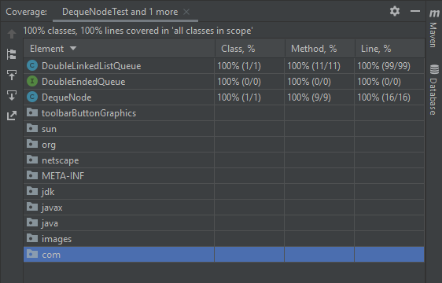

# Laboratorio 2: Lista doblemente encadenada - Mantenimiento y pruebas del Software

Objetivo: realizar una ejercicio en grupo (preferiblemente parejas, tres como
mucho) de pruebas unitarias. La práctica se desarrollará en dos sesiones de
laboratorio: 15/17 y 22/24 de marzo.

<details>
Trabajo previo:

Usar como referencia las recomendaciones del
artículo https://phauer.com/2019/modern-best-practices-testing-java/ (teniendo
en cuenta que el patrón Given, When, Then que aparece es similar al patrón AAA
visto en clase). Leer las páginas 63 -67 del capítulo 6 de libro "Pragmatic unit
testing in Java 8", prestando atención al aspecto de Boundary Conditions.
Enunciado: A partir de una interfaz DoubleEndedQueue, que representa una lista
con dos extremos (https://en.wikipedia.org/wiki/Double-ended_queue) que asume
una implementación con listas doblemente encadenadas, se plantea desarrollar una
clase DoubleLinkedListQueue que la implementa junto con una clase
DoubleLinkedListQueueTest que incluya las pruebas unitarias que se estimen
necesarias.

La interfaz DoubleEndedQueuees la siguiente:

```
public interface DoubleEndedQueue<T> {
// Basic operations
void append(DequeNode<T> node) ;
void appendLeft(DequeNode<T> node) ;
void deleteFirst() ;
void deleteLast() ;
DequeNode<T> peekFirst() ;
DequeNode<T> peekLast() ;
int size() ;

// Complex operations
DequeNode<T> getAt(int position) ;
DequeNode<T> find (T item) ;
void delete(DequeNode<T> node) ;
void sort(Comparator<?> comparator) ;
}
Se asume que los componentes de la lista doblemente encadenada son objetos de la clase DequeNode

/**

* Class representing a node of a double-ended queue (deque). Each node has pointers to the next and
* previous nodes. The previous and next of the first and last node of the deque is null.
*
* @param <T>
  */
  public class DequeNode<T> {

private T item;
private DequeNode<T> next;
private DequeNode<T> previous;

// Setters
public void setItem(T item) {
this.item = item;
}

public void setNext(DequeNode<T> next) {
this.next = next;
}

public void setPrevious(DequeNode<T> previous) {
this.previous = previous;
}

// Getters
public T getItem() {
return item;
}

public DequeNode<T> getNext() {
return next;
}

public DequeNode<T> getPrevious() {
return previous;
}

public DequeNode(T item, DequeNode<T> next, DequeNode<T> previous) {
this.item = item;
this.next = next;
this.previous = previous;
}

public boolean isFirstNode() {
return previous == null;
}

public boolean isLastNode() {
return next == null;
}

public boolean isNotATerminalNode() {
return (!isFirstNode() && !isLastNode());
}
}
```

Esta clase también hay que probarla, para lo que habrá que desarrollar una clase
llamada DequeNodeTest Requisitos:

Enumerar los casos de prueba de las dos clases en un fichero "testCases.txt"
Preparar un proyecto Maven para el código y para las pruebas con jUnit 5 Los
miembros de los grupos de trabajo usarán git y GitHub para desarrollar el
proyecto

Entregables:

Primer día de laboratorio (15/17 de marzo):
Pruebas de la clase DequeNode (clase DequeNodeTest)
Implementación y pruebas de las operaciones básicas de la interfaz
DoubleEndedQueue en la clase DoubleLinkedListQueue. Fichero testCases.txt
Segundo día de laboratorio (22/24 de marzo):
Proyecto completo en GitHub que incluirá, además de lo implementado en la
primera sesión de laboratorio:
La implementación y pruebas de las operaciones complejas propuestas. Fichero
testCases.txt Captura de pantalla que muestre el porcentaje de cobertura de
código alcanzada. Captura de pantalla que muestre que todos los tests se han
ejecutado con éxito. Opcional: analizar la calidad del código implementado con
la herramienta Sonarqube (https://www.sonarqube.org), entregando las capturas de
pantalla que se estimen oportunas.

</details>

## Sonarqube





## Coverage


